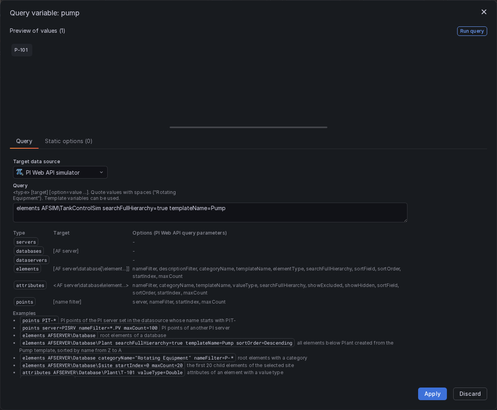

# Template variables

This page describes the variable queries of the PI Web API datasource and how variables are used in queries,
annotations and display names. The [README](../README.md#template-variables) has a short overview.

- [Variable queries](#variable-queries)
  - [Query types](#query-types)
  - [Options](#options)
  - [Examples](#examples)
  - [Variables inside a variable query](#variables-inside-a-variable-query)
  - [JSON queries of earlier versions](#json-queries-of-earlier-versions)
  - [Errors](#errors)
- [Using variables in queries](#using-variables-in-queries)
  - [Where variables can be used](#where-variables-can-be-used)
  - [Multi-value variables](#multi-value-variables)
  - [Series names and labels](#series-names-and-labels)
  - [Display names](#display-names)
  - [Combinations that do not exist](#combinations-that-do-not-exist)
  - [Limits](#limits)
- [Variables in annotations](#variables-in-annotations)
- [Turning streaming on and off with a variable](#turning-streaming-on-and-off-with-a-variable)

## Variable queries

Create a variable of type **Query**, select the PI Web API datasource and write the query in the variable editor:

```
<type> [target] [option=value ...]
```



The editor checks the query as you type and shows its help. The values of the variable are the names of the
objects found (servers, databases, elements, attributes or PI points).

### Query types

| Type          | Target                                                                        | Returns                                                                   |
| ------------- | ----------------------------------------------------------------------------- | ------------------------------------------------------------------------- |
| `servers`     | —                                                                             | AF servers                                                                |
| `databases`   | AF server (default: the AF server of the datasource)                          | AF databases of the server                                                |
| `elements`    | AF path of a database or element (default: the AF database of the datasource) | child elements of the target (all levels with `searchFullHierarchy=true`) |
| `attributes`  | AF path of an element (required)                                              | attributes of the element                                                 |
| `dataservers` | —                                                                             | PI servers (PI Data Archives)                                             |
| `points`      | point name filter                                                             | PI points of a PI server                                                  |

The type is not case sensitive. A target starting with `\\` is accepted (`\\AFSERVER\Database` is the same as
`AFSERVER\Database`).

### Options

Options are the query parameters of the PI Web API search, written as `name=value` after the target. Option names are
not case sensitive.

| Option                | Types                        | Value                                                                                   |
| --------------------- | ---------------------------- | --------------------------------------------------------------------------------------- |
| `nameFilter`          | elements, attributes, points | name filter with the wildcards `*` (any text) and `?` (one character)                   |
| `descriptionFilter`   | elements                     | description filter, with wildcards                                                      |
| `categoryName`        | elements, attributes         | category name                                                                           |
| `templateName`        | elements, attributes         | AF template name                                                                        |
| `elementType`         | elements                     | element type, e.g. `Any`, `Flow`, `Node`, `Boundary`                                    |
| `valueType`           | attributes                   | value type, e.g. `Double`, `Int32`, `String`, `Boolean`, `EnumerationValue`             |
| `searchFullHierarchy` | elements, attributes         | `true` to search all levels below the target, `false` (default) for the direct children |
| `showExcluded`        | attributes                   | `true` to include excluded attributes                                                   |
| `showHidden`          | attributes                   | `true` to include hidden attributes                                                     |
| `sortField`           | elements, attributes         | field to sort by, e.g. `Name`, `Description`                                            |
| `sortOrder`           | elements, attributes         | `Ascending` (default) or `Descending`                                                   |
| `startIndex`          | elements, attributes, points | index of the first value (0 based), to page through long lists                          |
| `maxCount`            | elements, attributes, points | maximum number of values (PI Web API default: 1000)                                     |
| `server`              | points                       | PI server (default: the PI server of the datasource)                                    |

- Values with spaces are quoted with `"` or `'`: `categoryName="Rotating Equipment"`.
- Boolean options take `true` or `false`; `startIndex` and `maxCount` take a number or a variable.
- For `points`, the name filter can be written after `points` or with `nameFilter=`, not both.
- `servers`, `databases` and `dataservers` have no options.

### Examples

PI points:

| Query                                  | Values                                                         |
| -------------------------------------- | -------------------------------------------------------------- |
| `points PIT-*`                         | points of the PI server of the datasource starting with `PIT-` |
| `points *.PV server=PISRV2`            | `.PV` points of another PI server                              |
| `points nameFilter=T-1?? maxCount=50`  | the first 50 points named `T-1` followed by two characters     |
| `points * startIndex=100 maxCount=100` | the second page of 100 points                                  |

Servers and databases:

| Query                 | Values                                       |
| --------------------- | -------------------------------------------- |
| `servers`             | AF servers known to PI Web API               |
| `databases`           | databases of the AF server of the datasource |
| `databases AFSERVER2` | databases of another AF server               |
| `dataservers`         | PI servers known to PI Web API               |

Elements:

| Query                                                                         | Values                                                  |
| ----------------------------------------------------------------------------- | ------------------------------------------------------- |
| `elements`                                                                    | root elements of the AF database of the datasource      |
| `elements AFSERVER\Database`                                                  | root elements of a database                             |
| `elements AFSERVER\Database\Plant`                                            | child elements of `Plant`                               |
| `elements AFSERVER\Database\Plant searchFullHierarchy=true templateName=Pump` | every pump below `Plant`, at any level                  |
| `elements AFSERVER\Database categoryName="Rotating Equipment" nameFilter=P-*` | root elements of a category whose name starts with `P-` |
| `elements AFSERVER\Database\Plant descriptionFilter=*tank*`                   | child elements with "tank" in their description         |
| `elements AFSERVER\Database\Plant sortField=Name sortOrder=Descending`        | child elements sorted from Z to A                       |
| `elements AFSERVER\Database\$site startIndex=0 maxCount=20`                   | the first 20 child elements of the selected site        |

Attributes:

| Query                                                                               | Values                                                |
| ----------------------------------------------------------------------------------- | ----------------------------------------------------- |
| `attributes AFSERVER\Database\Plant\T-101`                                          | attributes of an element                              |
| `attributes AFSERVER\Database\Plant\T-101 valueType=Double`                         | numeric (Double) attributes                           |
| `attributes AFSERVER\Database\Plant\T-101 nameFilter=Fl* categoryName=Process`      | attributes of a category whose name starts with `Fl`  |
| `attributes AFSERVER\Database\Plant\T-101 searchFullHierarchy=true showHidden=true` | all attributes, including child and hidden attributes |
| `attributes AFSERVER\Database\Plant\$tank`                                          | attributes of the tank selected in `$tank`            |

Values are names only. With `searchFullHierarchy=true`, elements found at different levels cannot be used in an
element path built as `...\$element`; use the levels as separate variables instead (e.g. `$site` then `$unit`).

### Variables inside a variable query

A variable query can use other variables, in the target and in option values. The variable is refreshed when they
change, so variables can be chained:

| Variable    | Query                                                       |
| ----------- | ----------------------------------------------------------- |
| `site`      | `elements AFSERVER\Database`                                |
| `unit`      | `elements AFSERVER\Database\$site`                          |
| `attribute` | `attributes AFSERVER\Database\$site\$unit valueType=Double` |

When a variable used in a variable query has several values selected, the query uses the first one.

### JSON queries of earlier versions

Variable queries saved before 6.0 are JSON objects. They keep working without changes:

| JSON query                                                                                      | Values                                     |
| ----------------------------------------------------------------------------------------------- | ------------------------------------------ |
| `{"path": ""}`                                                                                  | AF servers                                 |
| `{"path": "AFSERVER"}`                                                                          | databases of `AFSERVER`                    |
| `{"path": "AFSERVER\\Database"}`                                                                | root elements of the database              |
| `{"path": "AFSERVER\\Database\\Plant"}`                                                         | child elements of `Plant`                  |
| `{"path": "AFSERVER\\Database\\Plant", "filter": "T-*"}`                                        | child elements whose name starts with `T-` |
| `{"path": "AFSERVER\\Database\\Plant\\T-101", "type": "attributes"}`                            | attributes of `T-101` (at most 10000)      |
| `{"path": "AFSERVER\\Database\\Plant\\T-101", "type": "attributes", "filter": "L*", "max": 50}` | the first 50 attributes starting with `L`  |

Each JSON query can be rewritten in the new syntax, e.g. `{"path": "AFSERVER\\Database\\Plant", "filter": "T-*"}` is
`elements AFSERVER\Database\Plant nameFilter=T-*` and the last row is
`attributes AFSERVER\Database\Plant\T-101 nameFilter=L* maxCount=50`. Opening an old variable in the editor shows
its JSON query, which can be replaced by the new syntax at any time.

### Errors

The variable editor shows why a query is invalid, e.g. an unknown type or option, a missing closing quote,
`sortOrder must be Ascending or Descending` or `attributes need the path of an element`. When the server, database or
element does not exist, the variable gets no values and the preview shows an error.

## Using variables in queries

### Where variables can be used

| Query field                        | Example                         |
| ---------------------------------- | ------------------------------- |
| AF element path                    | `AFSERVER\Database\$site\$unit` |
| Attributes                         | `$attribute`                    |
| PI point names                     | `$point`, `${prefix}-101.PV`    |
| Calculation                        | `'.' * $factor`                 |
| Interpolate Period                 | `$interval`                     |
| Summary Period and Sample Interval | `$period`                       |
| Display Name                       | `${unit} ${attribute}`          |
| Streaming variable                 | `$live`                         |

Grafana's built-in variables work too, e.g. `$__interval` as the Interpolate Period.

Variables are also replaced when a query is opened in Explore, used in an expression or a recorded query, or turned
into an alert rule from a panel. Alert rules have no dashboard variables: the rule keeps the values the variables had
when it was created. The saved panel query keeps the variables.

### Multi-value variables

Multi-value variables, and the `All` option, are expanded into one series per selected value:

- **Element path**: several variables can be used, e.g. `AFSERVER\Database\${site}\${unit}`. Every combination of the
  selected values is queried.
- **Attributes and PI points**: a variable used as an attribute (e.g. `${attribute}`) or as a PI point name expands into
  one attribute or point per value.
- **Both**: element and attribute variables are combined.

Example: `$site` = `North`, `South`, `$unit` = `U-1`, `U-2` and `$attribute` = `Level`, `Flow` in the query

```
Element path: AFSERVER\Plants\${site}\${unit}
Attributes:   ${attribute}
```

returns 2 x 2 x 2 = 8 series, one for each site, unit and attribute (`North`/`U-1`/`Level`, `North`/`U-1`/`Flow`,
... `South`/`U-2`/`Flow`). See [Series names and labels](#series-names-and-labels) for how they are named.

PI point searches in the query editor search each value of a multi-value variable (at most 10 values) and merge the
points found.

A variable with a custom `All` value (e.g. `*`) is sent as that value and is not expanded.

### Series names and labels

| Data format                           | Series name                                               |
| ------------------------------------- | --------------------------------------------------------- |
| New ("Enable New Data Format" on)     | attribute or point name, e.g. `Level`                     |
| Old, no variable in the element path  | `<element>\|<attribute>`, e.g. `U-1\|Level`               |
| Old, one variable in the element path | `<value>\|<element>\|<attribute>`, e.g. `U-1\|U-1\|Level` |
| Old, several variables in the path    | element path below the database, e.g. `North\U-1\|Level`  |

With the new data format, AF series also have the labels `element`, `database`, `path` (element path below the
database), `type`, `units` and `description`, and PI points `element` (the PI server), `type`, `units` and
`description`; summaries add `summaryType`.

With the new data format, use the labels in the panel legend to tell the series apart, e.g. `{{path}}` or
`{{element}} {{name}}`. Alert rules with several series need these labels to tell the series apart, so they need the
new data format.

### Display names

The Display Name can use the variables of the query. With multi-value variables, each series gets its own values:

| Display Name           | Series names                                         |
| ---------------------- | ---------------------------------------------------- |
| `${unit} ${attribute}` | `U-1 Level`, `U-1 Flow`, `U-2 Level`, `U-2 Flow`     |
| `${site}/${unit}`      | `North/U-1`, `North/U-2`, ... (one name per element) |
| `Tank ${unit}`         | `Tank U-1`, `Tank U-2`                               |

A multi-value variable that is not used in the element path or the attributes is shown with all its values, e.g.
`{A,B}`. With
"Enable Regex Replace", the regular expression is applied to the name instead of the Display Name.

### Combinations that do not exist

Not every combination of values has to exist: an element may not have the attribute, or a site may not have the unit.
PI Web API answers "not found" for these combinations and the other series are still returned. The panel shows the
error unless "Ignore API Error?" is on in the query.

### Limits

A query can expand into at most 1000 element/attribute (or point) combinations. A larger expansion returns an error
that shows the count, e.g. `the template variables expand this query into 1200 targets (40 element paths x 30
attributes), the limit is 1000`. Select fewer values, or split the query.

## Variables in annotations

In event frame annotations, variables can be used in:

| Field          | Format                                              | Example       |
| -------------- | --------------------------------------------------- | ------------- |
| Name Filter    | PI Web API name filter (`{a,b}` for several values) | `$unit*`      |
| Category       | category name                                       | `$category`   |
| Attribute Name | comma-separated names (one field each)              | `$attributes` |

## Turning streaming on and off with a variable

With "Enable Streaming" on, the "Streaming variable" of the query can name a dashboard variable, e.g. `$live`. The
query streams when the variable resolves to `true`, `1` or `yes`, and returns its values without streaming otherwise.
A custom variable `live` with the values `true,false` adds an on/off switch to the dashboard. See
[Live streaming](../README.md#live-streaming).
